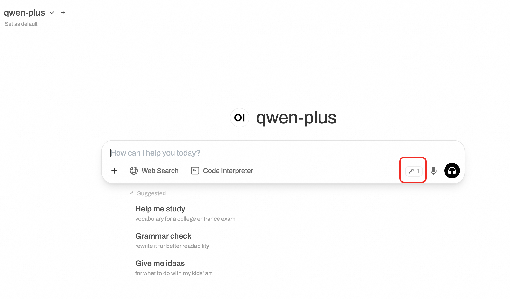

# 百炼 Open WebUI 服务实例部署文档

## Open WebUI和百炼介绍

Open WebUI 是一个功能丰富且用户友好的自托管 Web 用户界面（WebUI），它被设计用于与大型语言模型（LLMs）进行交互，特别是那些由 Ollama 或与 OpenAI API 兼容的服务所支持的模型。Open WebUI 提供了完全离线运行的能力，这意味着用户可以在没有互联网连接的情况下与模型进行对话，这对于数据隐私和安全敏感的应用场景尤为重要。
以下是 Open WebUI 的一些主要特点：
1. 直观的界面：Open WebUI 的界面受到 ChatGPT 的启发，提供了一个清晰且用户友好的聊天界面，使得与大型语言模型的交互变得直观。
2. 扩展性：这个平台是可扩展的，意味着可以通过添加新的插件或功能来定制和增强其能力，适应不同的使用场景和需求。
3. 离线操作：Open WebUI 支持完全离线运行，不依赖于网络连接，适合在任何设备上使用，无论是在飞机上还是在偏远地区。
4. 兼容性：它兼容多种 LLM 运行器，包括 Ollama 和 OpenAI 的 API，这使得用户可以从多个来源选择和运行不同的语言模型。
5. 自托管：用户可以在自己的服务器或设备上部署 Open WebUI，这为数据隐私和控制提供了更高的保障。
6. Markdown 和 LaTeX 支持：Open WebUI 提供了全面的 Markdown 和 LaTeX 功能，让用户可以生成富文本输出，这在科学和学术交流中非常有用。
7. 本地 RAG 集成：检索增强生成（RAG）功能允许模型利用本地存储的数据进行更深入和具体的回答，增强了聊天交互的功能。
通义百炼 是阿里巴巴云推出的一款先进的多模态预训练模型。它结合了自然语言处理（NLP）和计算机视觉（CV）技术，能够理解和生成文本、图像、视频等多种类型的数据。通义百炼的设计目标是为开发者和企业提供一个强大的工具，以便在各种应用场景中实现更高效、更智能的数据处理和分析。

## 高德MCP Server介绍
为实现 LBS 服务与 LLM 更好的交互，高德地图 MCP Server 现已覆盖12大核心服务接口，提供全场景覆盖的地图服务，包括地理编码、逆地理编码、IP 定位、天气查询、骑行路径规划、步行路径规划、驾车路径规划、公交路径规划、距离测量、关键词搜索、周边搜索、详情搜索等。为进一步提高开发者接入效率与体验，高德地图开放平台为开发者提供了通用级 SSE 协议 MCP 服务解决方案。


## 计费说明
Open WebUI面板在阿里云上的费用主要涉及：
* 所选GPU云服务器的规格
* 磁盘容量
* 公网带宽

计费方式：按量付费（小时）或包年包月
预估费用在创建实例时可实时看到。

百炼模型调用费用:
* 当您首次开通百炼时，平台会自动为您发放各模型的新人专属免费额度，详情请看[百炼新人免费额度](https://help.aliyun.com/zh/model-studio/new-free-quota?spm=a2c4g.11186623.help-menu-2400256.d_4_1.6dea55efFQCijR#view-quota)。

## RAM账号所需权限

| 权限策略名称                          | 备注                     |
|---------------------------------|------------------------|
| AliyunECSFullAccess             | 管理云服务器服务（ECS）的权限       |
| AliyunVPCFullAccess             | 管理专有网络（VPC）的权限         |
| AliyunROSFullAccess             | 管理资源编排服务（ROS）的权限       |
| AliyunComputeNestUserFullAccess | 管理计算巢服务（ComputeNest）的用户侧权限 |


## 部署服务

1. 单击[部署链接](https://computenest.console.aliyun.com/service/palworld/deploy?ServiceId=service-c0552c20597a4c62b168)，进入服务实例部署界面，根据界面提示，填写参数。
    
2. 部署参数需要百炼API-KEY，**[登录百炼控制台](https://bailian.console.aliyun.com/)**，光标悬停在右上角人行图标上，点击**API-KEY**。
    

    点击**创建我的API-KEY**，并复制它备用。API-KEY是个人保密信息，切勿泄漏。若未开通百炼，请点击[开通百炼的模型服务](https://help.aliyun.com/zh/model-studio/getting-started/first-api-call-to-qwen?spm=a2c4g.11186623.help-menu-2400256.d_0_1_0.5a06b0a8lg5WY2#5058e161041ps)完成开通。
    

    获取高德地图API KEY：进入[高德开放平台](https://lbs.amap.com/)，注册并获取高德API KEY备用。高德提供了免费额度。

3. 确认订单完成后点击**立即创建**。
4. 等待部署完成后就可以开始使用服务，进入服务实例详情点击Address访问。
    

5. 注册账号并登录服务。
    


## 运行MCP server

1. 远程连接ECS，执行以下命令启动MCP server:
    ```shell
    sudo su
    cd /root/mcp
    source venv/bin/activate
    mcpo --config config.json --port 8000 &
    ```
    


## 在open webui前端设置
1. 点击“设置”，点击“工具”。
2. 如果您是使用ECS的公网IP地址，在填写工具的地址时，应填写http://<ECS IP地址>:8000/amap-maps，而非localhost
    

3. 如果您设置了使用域名访问您的open webui网站。例如，您使用了https://example.com 访问您的Open WebUI网站，需要对您的nginx配置文件（在/etc/nginx/sites-available这个目录）做修改。在nginx配置文件中，增加如下内容。

    ```text
    # Proxy settings for MCP server
        location /mcp/ {
            proxy_pass http://localhost:8000/;
            proxy_set_header Host $host;
            proxy_set_header X-Real-IP $remote_addr;
            proxy_set_header X-Forwarded-For $proxy_add_x_forwarded_for;
            proxy_set_header X-Forwarded-Proto $scheme;
    
            proxy_http_version 1.1;
            proxy_set_header Upgrade $http_upgrade;
            proxy_set_header Connection "upgrade";
        }
    ```
    
    完整的配置文件如下。注意：请将下列文件中的example.com替换成您自己的域名。
    ```text
    server {
        listen 443 ssl;
        server_name example.com www.example.com;
    
    
        # SSL Configuration
        ssl_certificate /etc/nginx/ssl/example.com.pem;
        ssl_certificate_key /etc/nginx/ssl/example.com.key;
          
        # Security headers (optional but recommended)
        add_header Strict-Transport-Security "max-age=31536000" always;
        add_header X-Content-Type-Options nosniff;
        add_header X-Frame-Options "SAMEORIGIN";
        add_header X-XSS-Protection "1; mode=block";
    
        # Proxy settings
        location / {
            proxy_pass http://localhost:8080;  # Your service running on port 3000
            proxy_set_header Host $host;
            proxy_set_header X-Real-IP $remote_addr;
            proxy_set_header X-Forwarded-For $proxy_add_x_forwarded_for;
            proxy_set_header X-Forwarded-Proto $scheme;
    
    
            # WebSocket support (if needed)
            proxy_http_version 1.1;
            proxy_set_header Upgrade $http_upgrade;
            proxy_set_header Connection "upgrade";
        }
    
        # Proxy settings for MCP server
        location /mcp/ {
            proxy_pass http://localhost:8000/;
            proxy_set_header Host $host;
            proxy_set_header X-Real-IP $remote_addr;
            proxy_set_header X-Forwarded-For $proxy_add_x_forwarded_for;
            proxy_set_header X-Forwarded-Proto $scheme;
    
            proxy_http_version 1.1;
            proxy_set_header Upgrade $http_upgrade;
            proxy_set_header Connection "upgrade";
        }
    }
    ```

4. 保存nginx配置文件。重启nginx。
    ```shell
    sudo nginx -t  # Test the configuration
    sudo systemctl restart nginx
    ```

5. 在Open WebUI前端，按照如下方式配置。在页面中出现工具的符号，模型建议使用qwen-plus。


6. 可以发现，在与AI对话时，调用了高德地图的MCP服务

