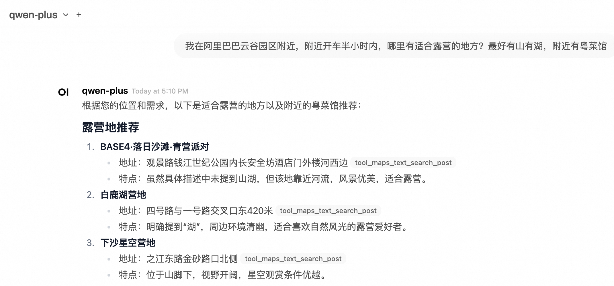

# 百炼 Open WebUI 服务实例部署文档

## Open WebUI和百炼介绍

Open WebUI 是一个功能丰富且用户友好的自托管 Web 用户界面（WebUI），它被设计用于与大型语言模型（LLMs）进行交互，特别是那些由 Ollama 或与 OpenAI API 兼容的服务所支持的模型。Open WebUI 提供了完全离线运行的能力，这意味着用户可以在没有互联网连接的情况下与模型进行对话，这对于数据隐私和安全敏感的应用场景尤为重要。
以下是 Open WebUI 的一些主要特点：
1. 直观的界面：Open WebUI 的界面受到 ChatGPT 的启发，提供了一个清晰且用户友好的聊天界面，使得与大型语言模型的交互变得直观。
2. 扩展性：这个平台是可扩展的，意味着可以通过添加新的插件或功能来定制和增强其能力，适应不同的使用场景和需求。
3. 离线操作：Open WebUI 支持完全离线运行，不依赖于网络连接，适合在任何设备上使用，无论是在飞机上还是在偏远地区。
4. 兼容性：它兼容多种 LLM 运行器，包括 Ollama 和 OpenAI 的 API，这使得用户可以从多个来源选择和运行不同的语言模型。
5. 自托管：用户可以在自己的服务器或设备上部署 Open WebUI，这为数据隐私和控制提供了更高的保障。
6. Markdown 和 LaTeX 支持：Open WebUI 提供了全面的 Markdown 和 LaTeX 功能，让用户可以生成富文本输出，这在科学和学术交流中非常有用。
7. 本地 RAG 集成：检索增强生成（RAG）功能允许模型利用本地存储的数据进行更深入和具体的回答，增强了聊天交互的功能。
通义百炼 是阿里巴巴云推出的一款先进的多模态预训练模型。它结合了自然语言处理（NLP）和计算机视觉（CV）技术，能够理解和生成文本、图像、视频等多种类型的数据。通义百炼的设计目标是为开发者和企业提供一个强大的工具，以便在各种应用场景中实现更高效、更智能的数据处理和分析。

本服务将openwebui和百炼集成，一键提供基于百炼的ui服务

## 计费说明
Open WebUI面板在阿里云上的费用主要涉及：
* 所选GPU云服务器的规格
* 磁盘容量
* 公网带宽

计费方式：按量付费（小时）或包年包月
预估费用在创建实例时可实时看到。

百炼模型调用费用:
* 当您首次开通百炼时，平台会自动为您发放各模型的新人专属免费额度，详情请看[百炼新人免费额度](https://help.aliyun.com/zh/model-studio/new-free-quota?spm=a2c4g.11186623.help-menu-2400256.d_4_1.6dea55efFQCijR#view-quota)。

## 部署架构

部署架构采用ECS(云服务器)单机部署


## RAM账号所需权限

| 权限策略名称                          | 备注                     |
|---------------------------------|------------------------|
| AliyunECSFullAccess             | 管理云服务器服务（ECS）的权限       |
| AliyunVPCFullAccess             | 管理专有网络（VPC）的权限         |
| AliyunROSFullAccess             | 管理资源编排服务（ROS）的权限       |
| AliyunComputeNestUserFullAccess | 管理计算巢服务（ComputeNest）的用户侧权限 |


## 部署服务

1. 单击[部署链接](https://computenest.console.aliyun.com/service/palworld/deploy?ServiceId=service-5ad5f65c6c5f4c3fb838)，进入服务实例部署界面，根据界面提示，填写参数。
    
2. 部署参数需要百炼API-KEY，**[登录百炼控制台](https://bailian.console.aliyun.com/)**，光标悬停在右上角人行图标上，点击**API-KEY**。
    

    点击**创建我的API-KEY**，并复制它备用。API-KEY是个人保密信息，切勿泄漏。
    

3. 确认订单完成后点击**立即创建**。
4. 等待部署完成后就可以开始使用服务，进入服务实例详情点击Address访问。
    

5. 注册账号并登录服务。
    

6. 登录成功后点击头像->设置。
    

7. 点击外部链接配置项中的添加链接按钮。
    

8. 输入URL和密钥（上文获取的APIKEY），添加要使用的模型ID（在[百炼模型广场](https://bailian.console.aliyun.com/#/model-market)选择目标模型，点击查看详后复制模型名称，粘贴到截图所示位置后添加），添加完成后保存配置。
    ```text
   https://dashscope.aliyuncs.com/compatible-mode/v1/
   ```
    

9. 配置完成后即可选择模型对话。
    


## 进阶操作（使用域名并绑定证书）

使用IP地址，例如http://公网IP:8080，访问自己部署的AI网站，不方便记忆，更不够酷。通过域名访问时，完整的方式是：https://example.com。大家平时可能不会注意到域名最左边的https。这是目前最常见的访问互联网的协议。早期的协议为http，后来为了增强安全性，在http后面加了个 "s"，即超文本传输安全协议，使用https需要SSL证书。现在大多数的网站都使用https，如果使用http，浏览器会提示不安全。另外，在开发微信小程序，苹果iOS app时，要求必须使用https。

### 一、购买域名，并完成域名备案，域名备案通常几天就可以完成。

### 二、获取免费SSL证书
1. 登入阿里云数字证书管理服务（原SSL证书）网站 https://www.aliyun.com/product/cas 点击“登录控制台”

   

2. 点击SSL证书管理

    

3. 点击“个人测试证书（原免费证书）”，然后点击“立即购买”。

    

4. 选择“个人测试证书”，可以获得20个免费的个人测试证书。

    

5. 购买完成后，点击“创建证书”，证书类型选择上一步购买的“个人测试证书（免费版）”，在“域名名称”中，输入域名，例如example.com, 此处可以不用输入www.example.com。然后点击“确定”。

    

6. 当证书显示“已签发”时，即可以正常使用。请注意，免费证书的有效期一般为三个月。

    

7. 点击“更多”，准备下载证书。

    

8. 点击“下载”的tab，点击Nginx后面的“下载”，即可以完成证书的下载。

    

9. 下载完的证书是一个压缩包，点击解压缩后，文件夹里有两个文件，分别以key和pem作为后缀。

    

### 三、在ECS云服务器上安装并配置nginx

```shell

# 更新安装包清单
sudo apt update
# 安装nginx
sudo apt install nginx
# 确认nginx是否安装成功
sudo systemctl status nginx
```

### 四、创建SSL证书存放目录并保存SSL证书到云服务器ECS
```shell

# 在nginx配置目录中，创建SSL证书存放目录
mkdir /etc/nginx/ssl
# 进入SSL证书存放目录
cd /etc/nginx/ssl

# 创建如下两个文件,此处假设域名为example.com，需要把域名替换成您自己的域名
touch example.com.key
touch example.com.pem

# 在电脑上，打开上一步保存的example.com.key文件，复制其中的内容

# 回到ECS云服务器，编辑example.com.key这个文件
vim example.com.key
# 点击i，进入编辑模式，并将刚复制的内容，粘贴到云服务器ECS上的example.com.key文件中，完成后，点击ecs退出编辑，输入!wq，保存并退出

# 在电脑上，打开上一步保存的example.com.pem文件，复制其中的内容
# 回到ECS云服务器，编辑example.com.key这个文件
vim example.com.pem
# 点击i，进入编辑模式，并将刚复制的内容，粘贴到云服务器ECS上的example.com.pem文件中，完成后，点击ecs退出编辑，输入!wq，保存并退出
```


### 五、配置nginx
```shell
# 进入sites-available目录
cd /etc/nginx/sites-available

# 创建配置文件，注意，此处需要换成您自己的域名
touch example.com
```

使用vim example.com命令，打开example.com文件，点击i进行编辑，粘贴以下内容。
注意：将下列内容中，所有的example.com替换成您自己的域名。
```txt
server {
    listen 80;
    server_name example.com www.example.com;

    # Redirect all HTTP requests to HTTPS
    return 301 https://$host$request_uri;
}

server {
    listen 443 ssl;
    server_name exameple.com www.example.com;

    # SSL Configuration
    ssl_certificate /etc/nginx/ssl/example.com.pem;
    ssl_certificate_key /etc/nginx/ssl/example.com.key;
      
    # Security headers (optional but recommended)
    add_header Strict-Transport-Security "max-age=31536000" always;
    add_header X-Content-Type-Options nosniff;
    add_header X-Frame-Options "SAMEORIGIN";
    add_header X-XSS-Protection "1; mode=block";

    # Proxy settings
    location / {
        proxy_pass http://localhost:8080;  # Your service running on port 8080
        proxy_set_header Host $host;
        proxy_set_header X-Real-IP $remote_addr;
        proxy_set_header X-Forwarded-For $proxy_add_x_forwarded_for;
        proxy_set_header X-Forwarded-Proto $scheme;

        # WebSocket support (if needed)
        proxy_http_version 1.1;
        proxy_set_header Upgrade $http_upgrade;
        proxy_set_header Connection "upgrade";
    }
}
```
### 六、建立软连接
注意：将下列内容中，所有的example.com替换成您自己的域名。
```shell
sudo ln -s /etc/nginx/sites-available/example.com /etc/nginx/sites-enabled/
```

重新load nginx
```shell
sudo systemctl reload nginx
```


### 七、配置域名解析
进入域名解析dns控制台
https://dns.console.aliyun.com/
选中需要使用的域名，点击“解析设置”


点击添“加记录”


按照如下方式填写记录内容，然后点击“确定”，约1分钟后生效。即可以通过域名访问您部署的AI网站。


## FAQ

DeepSeek-R1开启思考模式 [参考社区方案](https://www.zhihu.com/question/10904918866/answer/99141193645)